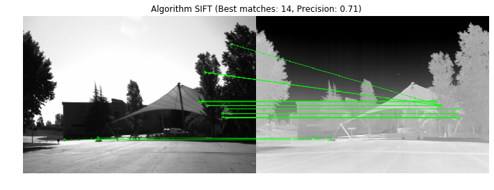
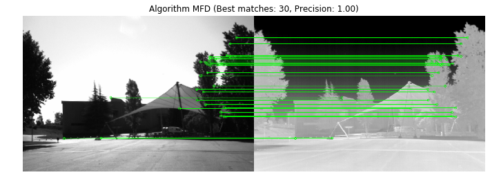

# Multispectral Feature Descriptor (MFD) [](https://github.com/cfgnunes/mfd/actions)

This is the Python 3 implementation of the Multispectral Feature Descriptor (MFD), as described in the paper "[A Local Feature Descriptor Based on Log-Gabor Filters for Keypoint Matching in Multispectral Images](https://ieeexplore.ieee.org/document/8024177)".

[Click here](https://github.com/cfgnunes/mfd/blob/master/MatchingExample.ipynb) to see a example.





## Paper abstract

This letter presents a new local feature descriptor for problems related to multispectral images.
Most previous approaches are typically based on descriptors designed to work with images uniquely captured in the visible light spectrum.
In contrast, this letter proposes a descriptor termed Multispectral Feature Descriptor (MFD) that is especially developed, such that it can be employed with image data acquired at different frequencies across the electromagnetic spectrum.
The performance of the MFD is evaluated by using three data sets composed of images obtained in visible light and infrared spectra, and its performance is compared with those of state-of-the-art algorithms, such as edge-oriented histogram (EOH) and log-Gabor histogram descriptor (LGHD).
The experimental results indicate that the computational efficiency of MFD exceeds those of EOH and LGHD, and that the precision and recall values of MFD are statistically comparable to the corresponding values of the forementioned algoexample-siftrithms.

## Bibtex

```TeX
@article{nunes2017local,
  author  = {Cristiano F. G. Nunes and Flavio L. C. Padua},
  title   = {A Local Feature Descriptor Based on Log-Gabor Filters for Keypoint Matching in Multispectral Images},
  journal = {{IEEE} Geoscience and Remote Sensing Letters},
  year    = {2017},
  volume  = {14},
  number  = {10},
  pages   = {1850--1854},
  month   = {oct}
}
```

## Datasets used in the paper

- Potsdam: <http://www2.isprs.org/commissions/comm3/wg4/2d-sem-label-potsdam.html>
- RGB-LWIR: <https://owncloud.cvc.uab.es/owncloud/index.php/s/1Wx715yUh6kDAO7>
- RGB-NIR: <http://ivrl.epfl.ch/supplementary_material/cvpr11/>

## Authors

- Cristiano Fraga Guimarães Nunes (<cfgnunes@gmail.com>)
- Flávio Luis Cardeal Pádua (<cardeal@cefetmg.br>)

## Getting Started

### Prerequisites

This section assumes Ubuntu 16.04 (also tested on Ubuntu 20.04), but the procedure is similar for other Linux distributions. The prerequisites is to install the following packages:

```sh
sudo apt -y install make python3-pip python3-venv
```

### Running the examples

To run the main example, use:

```sh
make run
```
